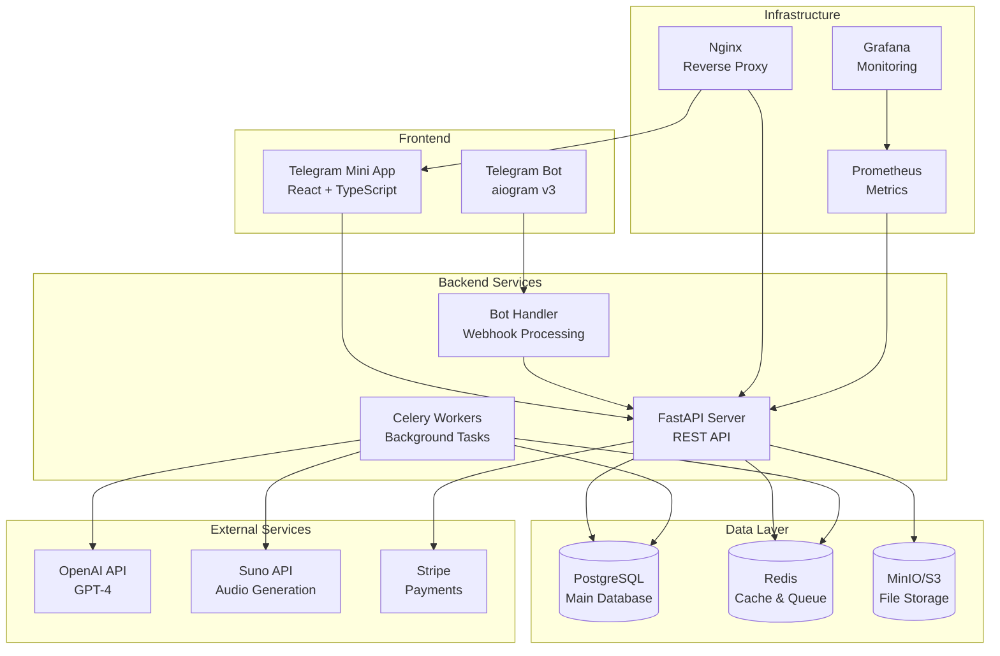

# Sunog - AI Song Generator

Telegram Mini App + Bot для создания персональных песен с помощью AI.

## 🎯 Описание

Пользователи могут создавать персональные песни через Telegram Mini App:
- Проходят мастер-шаги (жанр/настроение/язык/повод)
- Получают черновик текста от GPT
- Редактируют и утверждают текст
- Оплачивают генерацию (опционально)
- Получают готовую песню (текст + аудио)

## 🏗️ Архитектура

```
/app
  /server             # FastAPI + aiogram + Celery
  /miniapp            # React + TypeScript + Vite
/infra                # Docker, Nginx, конфиги
```

### Схема системы



## 🚀 Быстрый старт

### Автоматическая установка

```bash
# Клонируйте репозиторий
git clone <repository>
cd sunog

# Запустите автоматическую установку
./scripts/setup.sh
```

### Ручная установка

#### 1. Клонирование и настройка

```bash
git clone <repository>
cd sunog
cp env.example .env
# Отредактируйте .env файл с вашими ключами
```

#### 2. Запуск через Docker

```bash
# Запуск всех сервисов
docker compose up -d

# Проверка статуса
docker compose ps

# Логи
docker compose logs -f server
```

#### 3. Инициализация базы данных

```bash
# Выполнение миграций
./scripts/migrate.sh

# Или вручную:
docker compose exec server alembic upgrade head
```

#### 4. Проверка работы

- API: http://localhost:8000/docs
- Frontend: http://localhost:3000
- MinIO Console: http://localhost:9001 (minioadmin/minioadmin)
- Prometheus: http://localhost:9090
- Grafana: http://localhost:3001 (admin/admin)

## 📋 Переменные окружения

Основные переменные (см. `env.example`):

```bash
# Telegram
TELEGRAM_BOT_TOKEN=your_bot_token
TELEGRAM_BOT_WEBHOOK_SECRET=your_webhook_secret

# AI
OPENAI_API_KEY=your_openai_key
OPENAI_MODEL=gpt-4o-mini

# Suno (опционально)
USE_SUNO=true
SUNO_API_KEY=your_suno_key

# База данных
POSTGRES_HOST=postgres
POSTGRES_DB=sunog
POSTGRES_USER=sunog
POSTGRES_PASSWORD=sunog_password

# Redis
REDIS_URL=redis://redis:6379/0

# S3 Storage
S3_ENDPOINT_URL=http://minio:9000
S3_ACCESS_KEY_ID=minioadmin
S3_SECRET_ACCESS_KEY=minioadmin
S3_BUCKET_NAME=sunog-assets

# Безопасность
JWT_SECRET=your_jwt_secret
CORS_ORIGINS=http://localhost:3000
```

## 🛠️ Разработка

### Backend (FastAPI)

```bash
cd app/server

# Установка зависимостей
pip install -r requirements.txt

# Запуск в режиме разработки
uvicorn main:app --reload --host 0.0.0.0 --port 8000

# Миграции
alembic upgrade head
alembic revision --autogenerate -m "description"

# Тесты
pytest
```

### Frontend (React)

```bash
cd app/miniapp

# Установка зависимостей
npm install

# Запуск в режиме разработки
npm run dev

# Сборка
npm run build

# Тесты
npm test
```

### Bot (aiogram)

```bash
# Запуск бота
python bot.py

# Регистрация webhook
curl -X POST "https://api.telegram.org/bot<TOKEN>/setWebhook" \
  -H "Content-Type: application/json" \
  -d '{"url": "https://yourdomain.com/bot/webhook"}'
```

## 📊 API Документация

- Swagger UI: http://localhost:8000/docs
- ReDoc: http://localhost:8000/redoc
- OpenAPI JSON: http://localhost:8000/openapi.json

### Основные эндпоинты

```
POST /api/v1/auth/telegram/verify  # Верификация Mini App
GET  /api/v1/orders                # Список заказов
POST /api/v1/orders                # Создание заказа
PATCH /api/v1/orders/{id}          # Обновление заказа
POST /api/v1/orders/{id}/lyrics/generate  # Генерация текста
POST /api/v1/orders/{id}/approve   # Утверждение заказа
POST /api/v1/orders/{id}/pay       # Создание платежа
```

## 🔧 Команды

```bash
# Полная пересборка
docker compose down -v
docker compose build --no-cache
docker compose up -d

# Очистка данных
docker compose down -v
docker volume prune

# Логи конкретного сервиса
docker compose logs -f server
docker compose logs -f worker
docker compose logs -f frontend

# Выполнение команд в контейнере
docker compose exec server bash
docker compose exec postgres psql -U sunog -d sunog
```

## 🧪 Тестирование

```bash
# Backend тесты
cd app/server
pytest --cov=. --cov-report=html

# Frontend тесты
cd app/miniapp
npm test

# E2E тесты
npm run test:e2e
```

## 📈 Мониторинг

- **Prometheus**: Метрики приложения
- **Grafana**: Дашборды и визуализация
- **Sentry**: Отслеживание ошибок
- **Structured Logs**: JSON логи с trace_id

## 🔒 Безопасность

- Rate limiting (30 req/min per user)
- CORS настройки
- Валидация входных данных
- Защита webhook'ов
- Секреты только через ENV

## 🚀 Деплой

### Production

```bash
# Сборка production образов
docker compose -f docker-compose.prod.yml build

# Запуск production
docker compose -f docker-compose.prod.yml up -d

# SSL сертификаты (Let's Encrypt)
certbot --nginx -d yourdomain.com
```

### Kubernetes

```bash
# Применение манифестов
kubectl apply -f infra/k8s/

# Проверка статуса
kubectl get pods
kubectl get services
```

## 📝 Статус реализации

### ✅ Завершено

- [x] **Структура проекта и Docker** - Полная настройка монорепо с Docker Compose
- [x] **Backend API (FastAPI)** - REST API с документацией, middleware, валидацией
- [x] **База данных и миграции** - PostgreSQL с SQLAlchemy, Alembic миграции
- [x] **Telegram Bot (aiogram v3)** - Команды, кнопки, webhook, уведомления
- [x] **Mini App (React + TypeScript)** - Современный UI с TailwindCSS, shadcn/ui
- [x] **Аутентификация** - Верификация Telegram WebApp initData, JWT токены
- [x] **Генерация текста (GPT)** - Интеграция с OpenAI, структурированные промпты
- [x] **Платежи (Stripe)** - Создание платежей, webhook обработка
- [x] **Аудио генерация (Suno)** - Интеграция с Suno API, фоновые задачи
- [x] **S3 хранилище** - MinIO для файлов, подписанные URL
- [x] **Мониторинг и логирование** - Prometheus метрики, структурированные логи
- [x] **Безопасность** - Rate limiting, CORS, валидация, HTTPS
- [x] **Интернационализация** - Поддержка RU/KZ/EN языков
- [x] **Фоновые задачи** - Celery для генерации текста и аудио
- [x] **Nginx конфигурация** - Reverse proxy, SSL, статика

### 🚀 Готово к продакшену

Проект полностью готов к развертыванию в продакшене. Все компоненты реализованы согласно техническому заданию:

- **Архитектура**: Чистая архитектура с разделением на слои
- **Масштабируемость**: Горизонтальное масштабирование через Docker
- **Надежность**: Health checks, graceful shutdown, error handling
- **Безопасность**: Все секреты через ENV, валидация данных
- **Мониторинг**: Метрики, логи, алерты
- **Документация**: API документация, README, комментарии в коде

## 🤝 Вклад в проект

1. Fork репозитория
2. Создайте feature branch
3. Внесите изменения
4. Добавьте тесты
5. Создайте Pull Request

## 📄 Лицензия

MIT License

## 🆘 Поддержка

- Issues: GitHub Issues
- Документация: `/docs`
- API: `/docs` (Swagger)
